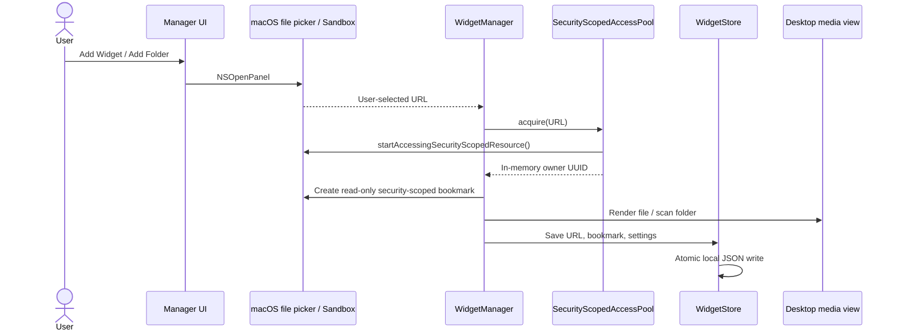

# Authentication, authorization, and local data

## Scope

BetterWidgets is a local macOS app. It does not authenticate users or send HTTP requests to a backend. There is no sign-in screen, authentication middleware, session cookie, refresh flow, API credential store, or Keychain code in the app. The authorization boundary is macOS App Sandbox and the user's selection of local media.

## Components

| Component | Role |
| --- | --- |
| [`BetterWidgetsApp.swift`](../BetterWidgets/BetterWidgetsApp.swift) | Starts the manager, restores widgets, owns the menu bar UI, and releases resources on termination. |
| [`WidgetManager.swift`](../BetterWidgets/WidgetManager.swift) | Presents `NSOpenPanel`, creates or replaces widgets, tracks access owners, restores bookmarks, and schedules persistence. |
| [`MediaLibrary.swift`](../BetterWidgets/MediaLibrary.swift) | Creates read-only security-scoped bookmarks, resolves folder bookmarks, and scans supported regular files. |
| [`SecurityScopedAccessPool.swift`](../BetterWidgets/SecurityScopedAccessPool.swift) | Shares acquired access, tracks owners by UUID, and balances successful start/stop calls. |
| [`WidgetModel.swift`](../BetterWidgets/WidgetModel.swift) | Stores file URLs, optional bookmark data, and widget settings. |
| [`WidgetStore.swift`](../BetterWidgets/WidgetStore.swift) | Reads and atomically writes the local JSON snapshot, rejecting duplicate widget or folder identities. |
| [`LaunchAtLoginManager.swift`](../BetterWidgets/LaunchAtLoginManager.swift) | Registers the app with `SMAppService.mainApp` and reports macOS approval status. This is login-item registration, not account authentication. |
| [`project.pbxproj`](../BetterWidgets.xcodeproj/project.pbxproj) and [`BetterWidgets.entitlements`](../BetterWidgets/BetterWidgets.entitlements) | Enable App Sandbox, read-only user-selected files, hardened runtime, and app-scoped bookmarks. No outgoing-network entitlement is configured. |

## Request flow: adding media

For a widget, `addWidget()` calls `chooseMedia()` and then `createWidgetImmediately`. Access is acquired before the bookmark and desktop view are created. Drag-and-drop feeds a URL through `createWidget(from:)` into the same creation path. A dropped URL still needs macOS-granted access; accepting a URL does not bypass the sandbox. If bookmark creation fails, the widget can retain its URL with a nil bookmark, so future access is not guaranteed.

For a folder, `addFolder(at:)` creates its bookmark first, acquires scope, schedules a background scan, and saves the folder. Unlike an individual widget, folder bookmark creation failure is thrown to the caller.

## Restore and access lifetime

1. `applicationDidFinishLaunching` calls `restoreWidgets()`, which reads the local snapshot through `WidgetStore.load()`.
2. `resolveMediaAccess(for:)` resolves each widget's bookmark with `.withSecurityScope`, acquires access, updates the URL, and refreshes stale bookmark data. Legacy entries without bookmarks use the stored URL and attempt to create a bookmark.
3. `refreshFolder(_:)` resolves each folder bookmark, transfers access ownership when its URL changes, refreshes moved or stale bookmarks, and scans the folder off the main thread.
4. Missing files remain saved and can be replaced through the manager. Resolution failures fall back to the last known URL; this does not grant additional access. File readability still depends on macOS permissions and availability.
5. Replacement acquires the new resource and releases the previous owner. Deleting a widget or removing a folder releases its owner. Hiding a widget retains its saved model and media access; it is not deletion.
6. On termination, the app saves the current state, closes desktop panels, cancels folder scans, and calls `releaseAll()`.

The pool's UUIDs are only process-local owner handles. They are never persisted or sent over a network. A failed `startAccessingSecurityScopedResource()` is not counted as a successful start; an owner still receives a UUID, which does not prove that the file is authorized. The pool retries when an owner later arrives with a usable scoped URL. `stopAccessingSecurityScopedResource()` is called only for a successfully started resource, after the final owner releases it. Stable owner IDs avoid losing the original acquisition when a bookmarked file moves.

## Credentials, tokens, and stored data

| Data | Handling |
| --- | --- |
| Passwords, OAuth/API/bearer/refresh tokens | Not used by the app. |
| Security-scoped bookmarks | OS-managed opaque `Data`; saved as base64 by `JSONEncoder`. These are persistent file-access references, not server authentication tokens. |
| Access-owner UUIDs | Held in memory in the pool and manager; discarded when released or the process exits. |
| Widget/folder UUIDs | Persisted object identities; distinct from access-owner UUIDs. |
| File URLs, folder names, media-item keys | Stored in the JSON; keys can include absolute paths. Original media is referenced rather than copied into the repository. |
| Widget settings | Geometry, media type, mute/enabled state, and folder membership are saved locally. |
| First-launch preference | `hasOpenedWidgetManager` is stored in `UserDefaults`. |
| Launch-at-login state | Queried from `SMAppService`; no saved authentication token or cached permission Boolean. |

`WidgetStore` uses the user-domain Application Support URL followed by `BetterWidgets/widgets.json`. Sandboxed builds resolve this under the application container. The app does not encrypt the JSON. Read failures prevent subsequent saves from overwriting the original file; duplicate identities are rejected before resource restoration.

Logs can contain media paths and persistence errors. Neither runtime snapshots nor logs should be attached to a public issue without inspection. Git ignores `widgets.json`, local logs, `dist/`, signing material, and user-specific Xcode state. `.gitignore` does not protect an already tracked file, so the publication check also inspects the Git index.

## Build-time identities and credentials

Code signing and notarization concern distribution identity; they do not log a user into BetterWidgets. The project does not include a developer team, private key, provisioning profile, or signing certificate. The default build uses an ad-hoc signature.

For distribution, [`scripts/build-release.sh`](../scripts/build-release.sh) accepts a Developer ID identity via `BETTERWIDGETS_SIGN_IDENTITY` and an existing notarization Keychain profile name via `BETTERWIDGETS_NOTARY_PROFILE`. The script passes the profile name to `notarytool --keychain-profile`; it does not read or embed the profile's credentials. Notarization contacts Apple's service from the build tool, not the running app. See [`RELEASE.md`](../RELEASE.md).

GitHub authentication belongs to the developer's external Git/connector setup. No GitHub credential is an application dependency or belongs in this source tree.

## References and limits

- [Apple: App Sandbox](https://developer.apple.com/documentation/security/app-sandbox)
- [Apple: Developer ID distribution](https://developer.apple.com/developer-id/)
- [`AUDIT.md`](../AUDIT.md): tested access ownership and restoration scenarios, including the limits of injected sandbox tests.

The code paths and local checks establish the implemented behavior; they do not establish that every sandbox prompt, cloud-file state, macOS version, or long-running media workload has been tested.
